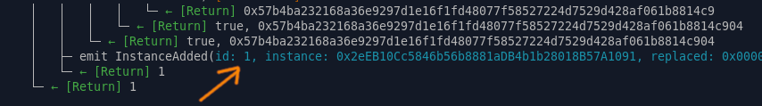

## Register a SGX prover to Moonchain

The following steps will interact with a L1 contract, means Arbitrum One for Moonchain Mainnet and Arbitrum Sepolia fro Moonchain Geneva Testnet. You will need some ETH on Arbitrum side to complete the process.

This process doesn't need to be perform on the SGX prover. You just need to get the SGX `quote` from the raiko `bootstrap.json` and pass to the process below.


1> Clone the source

```
mkdir -p ~/moonchain
cd ~/moonchain
git clone git@github.com:MXCzkEVM/mxc-mono.git -b moonchain-dev
cd mxc-mono
git submodule init
git submodule update
cd packages/protocol
pnpm install
pnpm compile
```


Check the contract address  setting in`script/config_dcap_sgx_verifier.sh`, and make it match with your target chain.

For Moonchain Geneva Testnet.

```
SGX_VERIFIER_ADDRESS=0x7FF12AC8385e67970eBB8aEAc6c42c133E690649 ATTESTATION_ADDRESS=0x3e0c0dAB767FE8BA386175F0d4C92D45A1A6A4Df PEM_CERTCHAIN_ADDRESS=0x20e01bbfd507a0a2d04bc6d06944d8c9ed7bc5fa
```

For Moonchain Mainnet.

```
SGX_VERIFIER_ADDRESS=
ATTESTATION_ADDRESS=
PEM_CERTCHAIN_ADDRESS=
```


Register the proofer with the quote you got from raiko initialization.

For Moonchain Geneva Testnet.

```
export PRIVATE_KEY=<YOUR PRIVATE KEY with leading 0x>
export FORK_URL=https://sepolia-rollup.arbitrum.io/rpc
./script/config_dcap_sgx_verifier.sh --quote <QUOTE FROM raiko INIT>
```

For Moonchain Mainnet.

```
export PRIVATE_KEY=<YOUR PRIVATE KEY with leading 0x>
export FORK_URL=https://arbitrum.llamarpc.com
./script/config_dcap_sgx_verifier.sh --quote <QUOTE FROM raiko INIT>
```

On success, you will get the instance id of your prover.





Mint a ERC721 NFT via ZkCenter.

```
cast send <ZKCENTER_CONTRACT_ADDRESS> "minerMint(uint256)" <SGX_INSTANCE_ID> --rpc-url https://sepolia-rollup.arbitrum.io/rpc --private-key <YOUR_PRIVATE_KEY>
```

